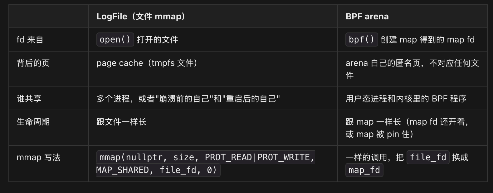

BpfJailer里的code有用mmap，用来做内存和文件的映射，这里mmap 写的是 page cache。优点是绕过的是 libc 的 **stdio 用户态缓冲**（`FILE*` 里那个 4KB buffer）和一次拷贝。

## read(fd, buf, n):
```
1. 数据不在 page cache 里 → 内核先从磁盘读进 page cache（tmpfs 不用这步，page cache 本身就是文件） 
2. 内核用 copy_to_user() 把数据从 page cache 拷到 buf ← 这就是那"一次拷贝" 
3. 返回后，你的代码再从 buf 里读`
```
mmap 省掉的是第 2 步：你拿到的指针直接指向 page cache 的页，中间不需要 `buf`。

## 创建mmap

```
int fd = open("/dev/shm/mylog", O_RDWR | O_CREAT, 0600);
void* p = mmap(nullptr, size, PROT_READ | PROT_WRITE, MAP_SHARED, fd, 0);
```

当然，貌似bpfjailer的code里面没有做msync，这个坑以后再填。

最近做bpfsnoop的项目，就需要更进一步学习bpf arena是如何利用mmap工作的。


